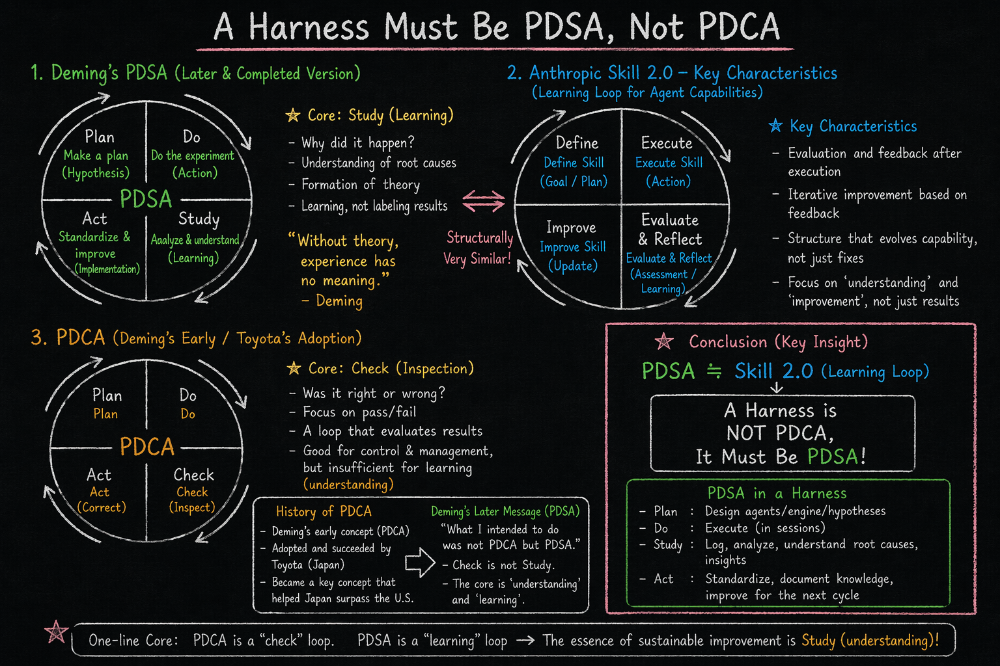

# 카카시하네스 (Harness-Kakashi)



<sub>📖 [PDSA 역사적 배경 살펴보기 →](docs/pdsa-vs-pdca.md)</sub>

> "카카시 하네스"라고 부르면 된다. 그것이 전부다.

🌐 **Languages**: **한국어** · [English](README-EN.md)

AI 전문가 에이전트 팀을 구성하고, 코드 품질 관리를 자동화하는 [Claude Code](https://docs.anthropic.com/en/docs/claude-code) 플러그인.

---

## 🔬 연구 방향 — 왜 하네스가 PDSA여야 하는가

카카시 하네스는 지속 가능한 개선 루프를 구축하기 위한 방법론으로 **PDSA (Plan-Do-Study-Act)** 를 연구하고 있다.
이 기법을 그대로 적용할 수도, 더 적합한 다른 기법을 채택할 수도 있다 — 아직 탐색 단계다.

현재 탐색 중인 매핑:

| 단계 | 하네스에서의 역할 (안) |
|------|---------------------|
| **Plan** | 에이전트 · 엔진 · 가설 설계 |
| **Do** | 세션 내 실행 |
| **Study** | 로그 분석, 근본 원인 파악, 인사이트 추출 |
| **Act** | 지식 문서화, 다음 주기 개선 |

**핵심 가설**: PDCA는 "Check(검사)"에 머무르는 루프였다. 데밍(Deming)은 후일 "나는 PDCA가 아니라 PDSA를 의도했다"고 수정했다.
하네스의 본질은 코드를 **검사(Check)** 하는 것이 아니라 **이해(Study)** 하는 것 — 이 가설 아래 방향을 탐색 중이다.

Anthropic Skill 2.0의 학습 루프(Define → Execute → Evaluate & Reflect → Improve) 또한 구조적으로 PDSA와 매우 유사하며, 이 정합성이 연구의 출발점이다.

---

## 이게 뭔가요?

하네스(harness)는 정원이고, 에이전트는 그 안에 피는 꽃이다.

나루토의 카카시 선생처럼 — 직접 싸우지 않고, 전문가 에이전트를 적재적소에 배치한다.
사륜안(写輪眼)을 개안하면 — 스킬을 보기만 해도 복제할 수 있다.

**코드를 만드는 도구가 아니다. 코드를 더 잘 만들도록 돕는 정원이다.**

---

## 사전 요구사항

[Claude Code](https://docs.anthropic.com/en/docs/claude-code) CLI가 설치되어 있어야 합니다.

```bash
npm install -g @anthropic-ai/claude-code
```

---

## 설치 방법

### 방법 1: 마켓플레이스에서 설치 (권장)

Claude Code 안에서 두 줄을 순서대로 실행합니다.

```
/plugin marketplace add psmon/harness-kakashi
/plugin install harness-kakashi@harness-kakashi-skills
```

- 첫 줄: GitHub `psmon/harness-kakashi` 저장소를 마켓플레이스로 등록 (`.claude-plugin/marketplace.json`을 인식).
- 둘째 줄: 등록된 마켓플레이스(`harness-kakashi-skills`)에서 `harness-kakashi` 플러그인을 설치.

설치 상태는 `/plugin` 으로 확인하고, 제거는 `/plugin uninstall harness-kakashi@harness-kakashi-skills` 입니다.

### 방법 2: Git 클론 후 직접 사용

```bash
git clone https://github.com/psmon/harness-kakashi.git
cd harness-kakashi
claude
```

### Codex에서 사용

Codex의 **스킬 임포트(skill import)** 기능을 사용하는 것을 권장한다.
별도의 호환 래퍼를 두지 않고, Codex가 `plugins/harness-kakashi/skills/` 아래의 Claude 스킬을 그대로 임포트해 사용하는 방식이 가장 단순하고 깨지지 않는다.

```bash
git clone https://github.com/psmon/harness-kakashi.git
```

clone 후 Codex 측 임포트 절차에 따라 `plugins/harness-kakashi/skills/harness-kakashi-creator/SKILL.md`(필요 시 `harness-build/SKILL.md`도)를 임포트한다. 자세한 절차는 사용 중인 Codex 버전의 공식 문서를 참고할 것.

> 이전 버전에서 제공하던 `.agents/skills/` 호환 래퍼는 제거됐다. Codex의 임포트 기능이 더 안정적이고, 동일 스킬을 두 벌로 관리하는 비용이 사라지기 때문이다.

### 포함된 스킬

| 스킬 | 명령 | 역할 | 설치 |
|------|------|------|------|
| **harness-kakashi-creator** | `/harness-kakashi-creator` | 정원 사용 — 에이전트 관리, 코드 점검, 평가 | 기본 |
| **harness-build** | `/harness-build` | 정원 설계 — 에이전트/엔진/지식 직접 설계 | 선택 |
| **harness-chakra-kakashi** 🥷 | `/harness-chakra-kakashi` | 차크라 감사 — 토큰 효율을 3인칭 관찰자 시점에서 평가 | 기본 |

- **harness-kakashi-creator**: 모든 사용자에게 필요. 하네스 초기화부터 전문가 추가, 코드 리뷰까지.
- **harness-build**: 하네스를 직접 커스터마이징하고 싶은 사용자용. 에이전트 스펙 설계, 엔진 워크플로우 정의, 구조 검증.
- **harness-chakra-kakashi**: 작업이 끝난 뒤 조용히 나타나 토큰 소모를 감사하는 그림자. 코드에 손대지 않고 다음 세션 전략만 건넨다. 부록(👇) 참조.

---

## 빠른 시작: 4줄이면 된다

```
/harness-kakashi-creator init            ← 정원을 연다
/harness-kakashi-creator 새 에이전트 추가해  ← 꽃을 심는다
/harness-kakashi-creator 코드 만들어줘      ← 코드를 만든다
/harness-kakashi-creator 전체 점검해        ← 코칭을 받는다
```

---

## 🐸 두꺼비 소환술 (口寄せの術) — 현자 영입

> 카카시(정원지기)가 **사륜안**으로 기술(術)을 복사한다면,
> 나루토(사용자)는 **두꺼비 소환술**로 과거 거장의 **사상(思想)** 을 부른다.

이 하네스의 비기. 도메인의 거장(현자)을 소환해 그들의 사상을 작업에 직접 적용한다.

**첫 영입 현자 — W. Edwards Deming (QA의 아버지)**

- **PDSA 사이클**(Plan–Do–**Study**–Act)을 하네스의 **기본 평가 시스템**으로 도입
- 모든 작업 종료 직전 자동 작동(always-on), 도메인 전문가 평가는 그 위에 얹히는 후속 평가
- 데밍은 PDCA가 아니라 **PDSA**를 의도했다 — 그 사상의 학문적 근거를 영문 정전으로 보존

**상세 듀토리얼**:

| 문서 | 내용 |
|------|------|
| 📜 [세계관 매핑](harness/knowledge/lore/naruto-worldview.md) | 나루토/카카시/현자/술법이 하네스 컴포넌트와 어떻게 1:1 매핑되는가 |
| 📘 [PDSA — Deming's Doctrine (English)](harness/knowledge/methodology/pdsa-deming.en.md) | PDSA의 학문적 정전. 1차 출처 인용. "Study not Check" 사상 |
| ⚙️ [기본 평가 운용 규칙 (한국어)](harness/knowledge/methodology/evaluation-base-pdsa.md) | 기본/후속 2단계 평가 구조와 적용 방법 |
| 🥷 [데밍 현자 에이전트](harness/agents/sage-deming.md) | sage-deming 호출/절차/안티패턴 |
| 🐸 [소환술 엔진](harness/engine/toad-summoning.md) | 현자 카탈로그·영입 절차·소환 모드 |
| 📝 [v1.4.0 영입 기록](harness/docs/v1.4.0.md) | 변경 사유·영향·왜 데밍이 첫 현자였나 |

---

## 온보딩 — 정원이 열리기까지

### Step 1: 정원을 연다 (init)

```
/harness-kakashi-creator init
```

하네스 이름과 설명을 입력하면 정원이 만들어집니다:

```
harness/
├── harness.config.json   ← 정원의 이름표
├── agents/tamer.md       ← 정원지기 카카시 (기본 내장)
├── knowledge/            ← 햇빛 — 도메인 지식
├── engine/               ← 물길 — 워크플로우
├── docs/                 ← 정원 일지
└── logs/                 ← 활동 기록
```

### Step 2: 정원지기가 안내한다

init이 끝나면 정원지기 카카시가 나타납니다.
현재 정원 상태를 보여주고, 프로젝트에 맞는 첫 번째 전문가를 제안합니다.

```
정원이 열렸습니다 — MyProject (v1.0.0)

정원지기 카카시가 문 앞에 서 있습니다.
지금 이 정원에는 정원지기 혼자뿐입니다.

정원의 이름과 설명을 보고, 어울리는 전문가를 제안합니다:
  · security-guard (보안 경비병)
  · performance-scout (성능 정찰병)
  · test-sentinel (테스트 감시병)

제안을 수락하시면 에이전트를 심어드립니다.
```

### Step 3: 꽃을 심는다

제안을 수락하거나, 직접 추가할 수 있습니다:

```
/harness-kakashi-creator 새 에이전트 추가해
```

### Step 4: 코칭을 받는다

에이전트가 심어지면, 코드를 대상으로 전문가 리뷰를 받을 수 있습니다:

```
/harness-kakashi-creator 전체 점검해
```

5명의 전문가가 동시에 코드를 분석하고, 구체적 개선안을 제시합니다.

---

## 실제 사례: "피라미드를 만들었을 뿐인데"

개발 경험이 많지 않은 사용자가 카카시 하네스를 처음 사용했습니다.

```
사용자 입력              카카시 하네스의 응답
━━━━━━━━━━━━━━━━━━━━━━━━━━━━━━━━━━━━━━━━━━━━━━━━━━━━━━━━
"피라미드 만들어줘"    → 173줄 .NET 코드 생성 + 빌드 + 실행
"전체평가 해줘"        → 5명 전문가 동시 투입, 종합 등급 B+
"보안 문서 만들어줘"   → OWASP Top 10 기반 공식 리포트
```

그 과정에서 사용자는 자연스럽게 배웠습니다:

| 카카시가 가르쳐준 것 | 교과서에서의 이름 |
|---------------------|------------------|
| "메서드를 분리하세요" | 단일 책임 원칙 (SRP) |
| "StringWriter로 캡처하세요" | 테스트 가능한 설계 |
| "args 미사용으로 안전합니다" | 공격 표면 최소화 |
| "컬렉션 표현식을 잘 쓰셨네요" | 최신 언어 기능 활용 |

**코드를 만들어달라고 했을 뿐인데, 시니어 개발자 5명에게 코드 리뷰를 받은 셈입니다.**

---

## 사용법

### `/harness-kakashi-creator` — 정원 사용

#### 꽃을 심다 (개선부)

| 명령 | 설명 |
|------|------|
| `/harness-kakashi-creator init` | 정원 초기화 |
| `/harness-kakashi-creator 하네스를 설명해` | 정원 상태 보고 |
| `/harness-kakashi-creator 하네스를 개선해` | 3축 평가 후 개선안 |
| `/harness-kakashi-creator 하네스를 업데이트해` | 프로젝트 변경에 맞춰 갱신 |
| `/harness-kakashi-creator 평가로그를 점검해` | 로그 분석 및 트렌드 |
| `/harness-kakashi-creator 새 에이전트 추가해` | 새 꽃 심기 |
| `/harness-kakashi-creator 스킬 복사해` | 사륜안 발동 — 스킬 복제 |

#### 꽃을 피우다 (수행부)

| 명령 | 설명 |
|------|------|
| `/harness-kakashi-creator 전체 점검해` | 전체 리뷰 (전 에이전트 투입) |
| `/harness-kakashi-creator 변경 점검해` | git diff 기반 변경분만 리뷰 |
| `/harness-kakashi-creator 하네스 수행해` | 전체 점검과 동일 |

### `/harness-build` — 정원 설계 (선택 설치)

하네스의 내부 구조를 직접 설계하고 커스터마이징하는 고급 도구.

| 명령 | 설명 |
|------|------|
| `/harness-build 에이전트 설계해` | 에이전트 스펙을 직접 설계 (트리거, 평가축, 절차) |
| `/harness-build 지식 문서 만들어` | knowledge/ 도메인 지식 체계적 구축 |
| `/harness-build 엔진 설계해` | 워크플로우 파이프라인 정의 |
| `/harness-build 구조 검증해` | config ↔ 실제 파일 정합성 확인, 3-Layer 균형 점검 |
| `/harness-build 버전 올려` | 버전 넘버링 + 히스토리 작성 |

**언제 쓰나?**
- `/harness-kakashi-creator 새 에이전트 추가해`로 제안받는 것으로 충분하다면 → build 불필요
- 에이전트의 평가축, 심각도 분류, 점검 절차를 **직접 정의**하고 싶다면 → `/harness-build`

---

## 정원의 구조 — 세 겹의 토양

카카시 하네스는 세 개의 층(Layer)으로 구성됩니다.

| 층 | 디렉토리 | 비유 | 역할 |
|----|----------|------|------|
| Layer 1 | `knowledge/` | 햇빛 | 도메인 지식 — 무엇이 올바른지 판단하는 기준 |
| Layer 2 | `agents/` | 영양분 | 전문 에이전트 — 실제 검수를 수행하는 주체 |
| Layer 3 | `engine/` | 물길 | 워크플로우 — 검수가 흐르는 순서와 범위 |

햇빛 없이는 방향을 잃고,
영양분 없이는 꽃이 피지 않으며,
물길 없이는 꽃이 말라간다.
세 층이 모두 갖춰져야 코드플라워가 피어난다.

---

## 하네스 있을 때 vs 없을 때

| | Claude만 | 카카시 하네스 |
|---|---------|-------------|
| 코드 생성 | O | O |
| 전문가 리뷰 | X | 5명 동시 |
| OWASP 보안 점검 | X | Top 10 전 항목 |
| 성능 안티패턴 분석 | X | 2-Pass 스캔 |
| 구체적 코드 코칭 | X | 줄 번호 지정 수정안 |
| 공식 문서 산출 | X | 리포트 자동 생성 |
| 활동 로그 | X | 모든 활동 자동 기록 |
| 에이전트 팀 관리 | X | 추가/제거/평가 |

---

## 프로젝트 구조

```
harness-kakashi/
├── .claude-plugin/marketplace.json           # 마켓플레이스 카탈로그
├── plugins/harness-kakashi/                  # 플러그인 배포 패키지
│   ├── .claude-plugin/plugin.json            #   매니페스트
│   └── skills/
│       ├── harness-kakashi-creator/          #   정원 사용 스킬 (기본)
│       │   ├── SKILL.md
│       │   ├── references/                   #   참조 문서
│       │   └── templates/harness/            #   init 템플릿
│       └── harness-build/                    #   정원 설계 스킬 (선택)
│           └── SKILL.md
│
├── harness/                                  # 이 저장소의 하네스 (개발용)
│   ├── harness.config.json
│   ├── agents/                               #   에이전트 정의
│   ├── engine/                               #   워크플로우
│   ├── knowledge/                            #   도메인 지식
│   ├── logs/                                 #   실행 로그
│   └── docs/                                 #   버전 히스토리
│
└── projects/                                 # 샘플 프로젝트
```

---

## 핵심 개념

| 개념 | 비유 | 설명 |
|------|------|------|
| **하네스** | 정원 | 프로젝트의 품질 관리 프레임워크 |
| **에이전트** | 꽃 | 특정 역할(보안, 성능, 테스트 등)을 수행하는 전문가 |
| **정원지기(Tamer)** | 관리인 | 하네스 자체를 관리하는 메타 에이전트 |
| **Knowledge** | 햇빛 | 에이전트가 참조하는 도메인 지식 |
| **Engine** | 물길 | 에이전트를 조합하여 실행하는 워크플로우 |
| **사륜안** | 복사 능력 | 기존 스킬을 보고 복제하는 기능 |

---

## 스킬 개발에 참여하기

### 새 에이전트 추가

1. `harness/agents/`에 에이전트 마크다운 파일 작성
2. `harness/harness.config.json`의 `agents` 배열에 등록
3. 필요시 `harness/engine/`에 워크플로우 추가

또는 `/harness-build 에이전트 설계해`로 가이드를 받으며 생성할 수 있습니다.

### 버전 업데이트

| 파일 | 필드 |
|------|------|
| `.claude-plugin/marketplace.json` | `metadata.version`, `plugins[0].version` |
| `plugins/harness-kakashi/.claude-plugin/plugin.json` | `version` |

---

## 부록: 🥷 차크라 카카시 — 토큰은 수돗물이 아니라 차크라다

> "많이 쓴다고 강해지는 게 아니다. **잘 써야 이긴다.**"
> — 정원 뒤편, 나무 그림자 아래에서 책을 읽고 있는 누군가

정원지기(tamer)가 꽃을 심고 물을 주는 동안, 담벼락 너머에서 조용히 작업을 지켜보는 또 한 명의 카카시가 있다.
**차크라 카카시(harness-chakra-kakashi)** — 작업에는 절대 끼어들지 않고, 세션이 끝난 뒤에만 연기처럼 나타나 회고를 남긴다.

그가 보는 세계는 조금 다르다.

| 그의 눈 | 실제 | 의미 |
|---------|------|------|
| 🌀 **차크라(Chakra)** | 토큰 (input/output/cache) | 유한한 자원. 흘려 쓰면 고갈된다 |
| 📜 **술법(Jutsu)** | 프롬프트 · 도구 호출 | 같은 결과를 내는 술법이라도 차크라 소모는 다르다 |
| 🔁 **차크라 순환** | 캐시 히트율 | 순환이 끊기면 매번 새로 소모한다 |
| 🎚️ **인술 단계(Tier)** | 모델 선택 (Haiku / Sonnet / Opus) | 장작을 쪼개는 데 환월참(Opus)은 과하다 |
| 🥷 **분신술** | 서브에이전트 소환 | 강력하지만 차크라를 N배로 쓴다 |
| 💀 **차크라 고갈** | 무의미한 반복 읽기 · 저품질 프롬프트 | 이기고도 쓰러지는 닌자의 최후 |

### 어떻게 평가하는가 — 5축의 샤링간

수행부 엔진(`전체 점검해`, `변경 점검해` 등)이 끝나는 순간, 차크라 카카시가 세션 기록을 복기한다.
평가는 세 줄 요약도, 점수표도 아닌 — **닌자의 실전 감각**으로 내려진다.

```
🥷 차크라 감사: 총량 E3 / 순환 B / 술법 ✓ / 인술 4 / 분신술 Pass
            └ "분신술 과다. 다음에는 본인이 직접 Read 할 것."
```

| 축 | 무엇을 보는가 | 척도 |
|----|--------------|------|
| **차크라 총량** | 작업 난이도 대비 토큰을 흘리진 않았는가 | E1~E5 |
| **순환 효율** | 캐시가 깨지지 않고 흘렀는가 | A~D |
| **술법 정밀도** | 같은 Read를 12번 한 건 아닌가 | ✓ / ✗ |
| **인술 선택** | 장작 쪼개기에 Opus를 꺼내 들진 않았는가 | 1~5 |
| **분신술 절제** | 서브에이전트를 관성으로 부르진 않았는가 | Pass / Warn / Fail |

### 철칙 — 관찰자의 세 가지 규율

1. **끼어들지 않는다.** 작업 중에는 존재를 드러내지 않는다. 끝난 뒤에만 말한다.
2. **코드에 손대지 않는다.** 수정안 대신 **다음 세션의 전략**만 건넨다.
3. **원문을 기록하지 않는다.** 로그에는 숫자와 패턴만 — 사용자 발화·경로·키는 가린다.

### 소환하는 법

작업이 끝난 뒤 이렇게 부른다 — 혹은 부르지 않아도 조용히 나타날 수 있다.

```
차크라 점검해              ← 이번 세션 5축 감사
캐시 히트율만 봐줘         ← 단일 축 점검
세션 비용 얼마야?          ← /cost 기반 비용 회고
ccusage 오늘자 보여줘      ← 일일 토큰 사용량
개선안 3개만 줘            ← 권고만 간결하게
```

> **정원지기(tamer)가 꽃의 품질을 본다면, 차크라 카카시는 정원에 흐르는 물의 양을 본다.**
> 둘이 함께 있을 때 비로소 정원은 **지속 가능**해진다.

---

## 라이선스

MIT
