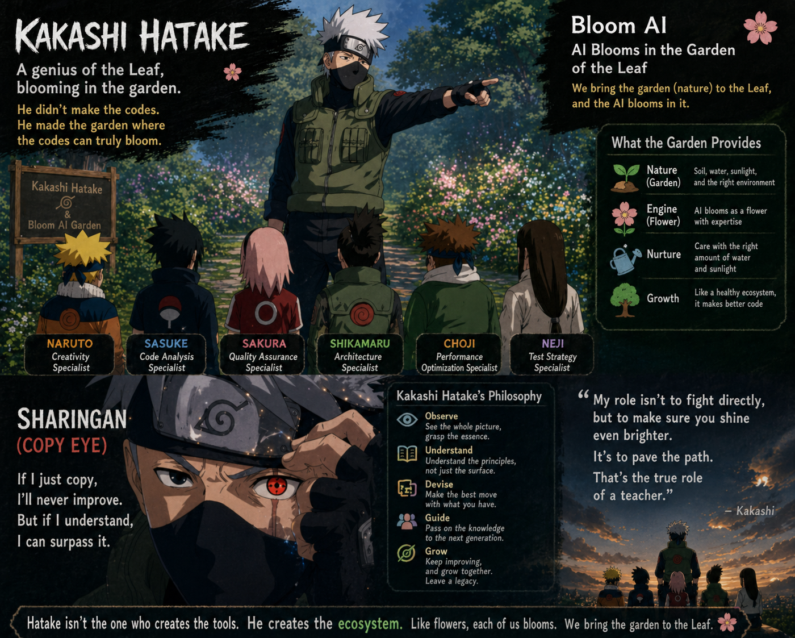

**언어 / Language / 言語**: [🇰🇷 한국어](naruto-harness-story-tutorial.md) · 🇺🇸 English (current) · [🇯🇵 日本語](naruto-harness-story-tutorial.ja.md)

# Kakashi Harness Worldview Tutorial — Understanding Through Naruto

> This document is an introductory storyline under `docs`.
> The actual operational rules of the harness follow `harness/knowledge/lore/naruto-worldview.md` as the canon.

## 1. This Is How the Story Begins

One day, you stand before the code forest.

Inside the forest lurk old legacies, failing tests, design smells that have yet to be named, and sometimes hidden performance bottlenecks. You could go in alone, but in the harness worldview, you are not someone who recklessly charges in with a sword.

You are **Naruto**.

Naruto is the protagonist of this world. But being the protagonist does not mean doing everything alone. Naruto brings the problem, sets the direction of the battle, and unleashes powerful jutsus when needed. In the harness, this is the position of the **user**, or the **caller**.

## 2. Why Kakashi Doesn't Fight Directly

At the entrance of the forest, Kakashi is waiting.

Kakashi is strong, but in the harness, his strength is not "I'll handle it all." He is a gardener. He knows which expert to assign to which problem, when to run an evaluation, and whether the moment calls for attack or observation.

So rather than fixing all the code himself, Kakashi places agents within the harness in the right roles at the right times.

| Character in the Story | Meaning in the Harness | In Plain Words |
|---|---|---|
| Naruto | User / Caller | The one who brings the problem |
| Kakashi | tamer / Gardener | The one who decides who to entrust |
| Sage | sage agent | An entity that lends a master's way of thinking |
| Chakra Kakashi | shadow observer | An observer who reflects on token usage after the work |

The important point here is one thing.

**Kakashi does not steal the protagonist's role.**

If the user is Naruto, Kakashi is the teacher who organizes a team so the user can make better decisions. This is also why the harness uses the metaphor of a "garden." Kakashi is not the one who blooms flowers on your behalf; he is the one who knows which flower grows well where.

## 3. The Sharingan Copies Techniques

Kakashi's signature ability is the Sharingan.

In the harness, the Sharingan is closer to the ability to look at a skill and read its structure. It grasps what input a skill takes, what procedure it follows, and what artifacts it leaves behind. And when needed, it brings that pattern into the harness.

This is very powerful, but it has limits.

The Sharingan copies **techniques**. That is, it reads the form of a jutsu already before its eyes. But some problems require more than technique. There are moments when it becomes more important to ask why this evaluation should be done, by what standard one should learn, and whether failure should be seen merely as pass/fail or as material for the next experiment.

At those moments, Naruto uses a different jutsu.

## 4. The Toad Summoning Calls Forth Philosophies

The Toad Summoning is not simply a technique to call one more strong companion.

In the harness worldview, the Toad Summoning is **sage summoning**. It calls a master from the past, a thought system already validated, into the current workspace. Summon Deming and you come to view quality and improvement through PDSA; one day, summon Fowler and you may come to view refactoring and architecture through the lens of evolutionary design.

The difference between the Sharingan and summoning can be summarized like this.

| Ability | What It Brings | Meaning in the Harness |
|---|---|---|
| Sharingan | Techniques, procedures, patterns | Reads and copies a skill |
| Toad Summoning | Philosophy, criteria, worldview | Applies a sage's thought system to the work |

So "summoning Deming the sage" does not simply mean running another QA checklist.

It means re-asking the entire work in this way.

- Plan: What did we expect?
- Do: What did we actually do?
- Study: What did we learn from the result?
- Act: What will we change in the next cycle?

This is also why Deming is the first sage in the harness. Evaluation itself is his domain.

## 5. The Shadow Clone Jutsu Is Parallel Work

The Shadow Clone Jutsu is easy to understand as a scene where multiple agents move at the same time.

For example, if within a single task you need to look at it from the perspectives of security, performance, and testing, each expert can move in parallel. Here, the Shadow Clone Jutsu is not "summon as many as possible carelessly." Summon too many and chakra runs out.

In harness terms, parallel agents are powerful but have a token cost. So Kakashi must deploy only as many as necessary.

## 6. Chakra Is Tokens

If chakra is the resource for all jutsus in the world of Naruto, then in the harness, chakra is tokens.

Input tokens, output tokens, and cache tokens are all chakra. A good ninja does not recklessly fire off massive jutsus. The same goes for a good harness. It reads only the necessary context, summons only the necessary experts, and spends only enough energy to leave behind a result.

Here is where **Chakra Kakashi** appears.

Chakra Kakashi does not interrupt to disturb the flow during the work. Instead, after the work is done, he quietly appears and asks.

> Where was chakra spent in this battle?
> Can you move more shortly and accurately next time?

This role addresses the quality of the way of working as much as the quality of the code.

## 7. The First Episode: Summoning Deming the Sage

Now let's tie it together into a single scene.

You, who are Naruto, say:

> "I want to see whether this work is a real improvement. Summon Deming the sage."

Kakashi nods. He first checks the contract. He sees whether `sage-deming` is registered in the harness. If it is registered, the toad summoning is invoked.

Out of the smoke, Deming the sage appears. He does not immediately praise or scold the code. Instead, he unfolds the work back through the PDSA cycle.

| Stage | Question Deming the Sage Asks |
|---|---|
| Plan | What was the hypothesis you set at the start? |
| Do | What did you actually execute? |
| Study | What did you learn from the difference between expectation and result? |
| Act | What will you adjust in the next iteration? |

In this moment, the harness becomes not merely a review tool but a learning device.

It does not end at confirming whether the test passed; it studies why such a result emerged. This is why in PDSA it is not `Check` but `Study` that matters.

## 8. How to Use This Tutorial

When reading this document, you do not need to memorize the worldview.

Instead, just remember these four sentences.

1. I am Naruto. I bring the problem and, when needed, summon.
2. Kakashi is the gardener. He does not fight everything himself; he places the right experts.
3. Sages are the philosophies of masters. Not mere tips, but lent thought systems.
4. Chakra is tokens. The stronger the jutsu, the more conscious of cost one must be.

Once these four sentences are grasped, the harness's Naruto mapping becomes not decoration but a memory device.

The Kakashi Harness is not "a system that attaches many agents." It is a way of building a better learning loop by summoning gardeners, sages, and observers while the user remains the protagonist.

## 9. Relationship to the Canon Document

This tutorial is a story for explanation. It does not become the basis for adding new characters or new jutsus.

To change operational rules, they must first be reflected in the canon document `harness/knowledge/lore/naruto-worldview.md`. This document is a signpost that helps those reading those rules for the first time understand them more easily.
