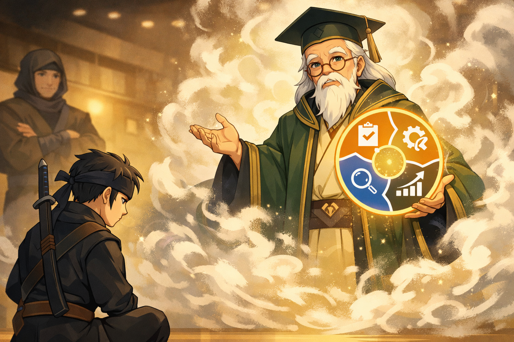

**언어 / Language / 言語**: [🇰🇷 한국어](naruto-harness-story-tutorial.md) · [🇺🇸 English](naruto-harness-story-tutorial.en.md) · 🇯🇵 日本語 (現在)

# カカシハーネス世界観チュートリアル — ナルトで理解する

> この文書は `docs` 配下の入門用ストーリーラインである。
> ハーネスの実際の運用ルールは `harness/knowledge/lore/naruto-worldview.md` を正典(canon)として従う。

## 1. 物語はこう始まる

ある日、あなたはコードの森の前に立つ。

森の中には古いレガシー、失敗するテスト、まだ名前のつけられていない設計の匂い、そして時には性能のボトルネックが潜んでいる。一人で入っても構わないが、ハーネス世界観では、あなたは無闇に刀を抜いて飛び込む者ではない。

あなたは **ナルト** だ。

ナルトはこの世界の主人公だ。しかし主人公という言葉は、すべてを一人で行うという意味ではない。ナルトは問題を持ち込み、戦いの方向を定め、必要なときに強力な術を発動する。ハーネスにおいて、これは **ユーザー**、または **呼び出し元(caller)** の位置である。

## 2. なぜカカシは自ら戦わないのか

森の入り口でカカシが待っている。

カカシは強いが、ハーネスにおける彼の強さは「俺がすべて片付ける」ではない。彼は庭師である。どの問題にどの専門家を当てるか、どのタイミングで評価を回すか、今は攻めるべきか観察すべきかを知っている。

だからカカシは自らすべてのコードを直すよりも、ハーネス内のエージェントを適材適所に配置する。

| 物語の登場人物 | ハーネスにおける意味 | 平たく言えば |
|---|---|---|
| ナルト | ユーザー / 呼び出し元 | 問題を持ち込む者 |
| カカシ | tamer / 庭師 | 誰に任せるかを決める者 |
| 賢者 | sage agent | 巨匠の思考法を貸してくれる存在 |
| チャクラカカシ | shadow observer | 作業後にトークン使用を振り返る観察者 |

ここで重要な点は一つだ。

**カカシは主人公の座を奪わない。**

ユーザーがナルトであるなら、カカシはユーザーがより良い決定を下せるようにチームを編成してくれる先生である。ハーネスが「庭」という比喩を使う理由もここにある。カカシは代わりに花を咲かせる者ではなく、どの花がどこでよく育つかを知る者である。

## 3. 写輪眼は技術を写す

カカシの代表的な能力は写輪眼だ。

ハーネスにおいて写輪眼は、スキルを見てその構造を読み取る能力に近い。あるスキルがどんな入力を受け、どんな手順で動き、どんな成果物を残すかを把握する。そして必要な場合はそのパターンをハーネス内に取り込む。

これは非常に強力だが限界がある。

写輪眼は **技術** を写す。つまり、すでに眼前にある術の形を読む。しかしある問題は技術だけでは足りない。なぜこの評価をしなければならないのか、どんな基準で学習すべきか、失敗を合否としてのみ見るのか、それとも次の実験の材料として見るのかが、より重要になる瞬間がある。

そのときナルトは別の術を使う。

## 4. 蛙の口寄せは思想を呼ぶ

蛙の口寄せは、単に強い仲間をもう一人呼ぶ技ではない。

ハーネス世界観において蛙の口寄せは **賢者召喚** である。過去の巨匠、すでに検証された思想体系を現在の作業場に呼び寄せる。デミングを呼べば品質と改善を PDSA の視点で見るようになり、いずれファウラーを呼べばリファクタリングとアーキテクチャを進化的設計の観点から見るようになるかもしれない。

写輪眼と口寄せの違いは次のように整理できる。

| 能力 | 持ってくるもの | ハーネス的な意味 |
|---|---|---|
| 写輪眼 | 技術、手順、パターン | スキルを読み取り写す |
| 蛙の口寄せ | 思想、基準、世界観 | 賢者の思考体系を作業に適用する |

だから「デミング賢者を召喚する」という言葉は、単に QA チェックリストをもう一つ回すという意味ではない。

それは作業全体をこのように問い直すという意味だ。

- Plan: 私たちは何を予想したか?
- Do: 実際に何をしたか?
- Study: 結果から何を学んだか?
- Act: 次のサイクルでは何を変えるか?

ハーネスにおいてデミングが最初の賢者である理由もここにある。評価そのものが彼の領域だからだ。

## 5. 影分身は並列作業である

影分身は、複数のエージェントが同時に動く場面として理解すれば容易だ。

例えば一つの作業の中でセキュリティ、性能、テストの観点を分けて見る必要があるなら、各専門家が並列に動くことができる。このとき影分身は「闇雲にたくさん呼ぶこと」ではない。呼びすぎればチャクラが枯渇する。

ハーネス的に言えば、並列エージェントは強力だがトークンコストがある。だからカカシは必要な分だけ配置しなければならない。

## 6. チャクラはトークンである

ナルトの世界でチャクラがすべての術の資源であるなら、ハーネスにおいてチャクラはトークンである。

入力トークン、出力トークン、キャッシュトークンがすべてチャクラだ。良い忍は無闇に大きな術を乱発しない。良いハーネスも同じである。必要な文脈を読み、必要な専門家を呼び、結果を残せるだけのエネルギーを使う。

ここで **チャクラカカシ** が登場する。

チャクラカカシは作業の途中に割り込んで流れを妨げない。代わりに作業が終わった後に静かに現れて問う。

> 今回の戦闘でチャクラはどこに使われたか?
> 次回はもっと短く正確に動けるか?

この役割はコード品質と同じくらい、作業方法の品質を扱う。

## 7. 最初のエピソード: デミング賢者の召喚

では一つの場面にまとめてみよう。

ナルトであるあなたが言う。

> 「今回の作業がちゃんとした改善なのか見たい。デミング賢者を召喚せよ。」

カカシは頷く。彼はまず契約を確認する。ハーネスに `sage-deming` が登録されているかを見る。登録されていれば蛙の口寄せが発動する。

煙の中からデミング賢者が現れる。彼はコードをすぐに褒めたり叱ったりしない。代わりに作業を PDSA サイクルで再び広げて並べる。

| 段階 | デミング賢者が問う質問 |
|---|---|
| Plan | 最初に立てた仮説は何だったか? |
| Do | 実際に何を実行したか? |
| Study | 予想と結果の差から何を学んだか? |
| Act | 次の反復で何を調整するか? |

この瞬間、ハーネスは単なるレビュー道具ではなく、学習装置になる。

テストが通ったかを確認するところで終わらず、なぜそうした結果が出たのかを学ぶ。これが PDSA において `Check` ではなく `Study` が重要である理由だ。

## 8. このチュートリアルの使い方

この文書を読むときは、世界観を暗記しようとしなくてよい。

代わりに次の四つの文だけを覚えればよい。

1. 私はナルトだ。問題を持ち込み、必要なら召喚する。
2. カカシは庭師だ。自らすべてを戦わず、適切な専門家を配置する。
3. 賢者は巨匠の思想だ。単なるヒントではなく思考体系を貸してくれる。
4. チャクラはトークンだ。強い術ほどコストを意識しなければならない。

この四つの文が掴めれば、ハーネスのナルトマッピングは装飾ではなく記憶装置になる。

カカシハーネスは「エージェントをたくさん貼り付けるシステム」ではない。ユーザーが主人公として残ったまま、庭師と賢者と観察者を呼び、より良い学習ループを作る方式である。

## 9. 正典文書との関係

このチュートリアルは説明のための物語である。新しい人物や新しい術を追加する根拠にはならない。

運用ルールを変更するには、必ず正典文書である `harness/knowledge/lore/naruto-worldview.md` に先に反映しなければならない。この文書はそのルールを初めて読む人がより容易に理解できるようにする案内板である。
