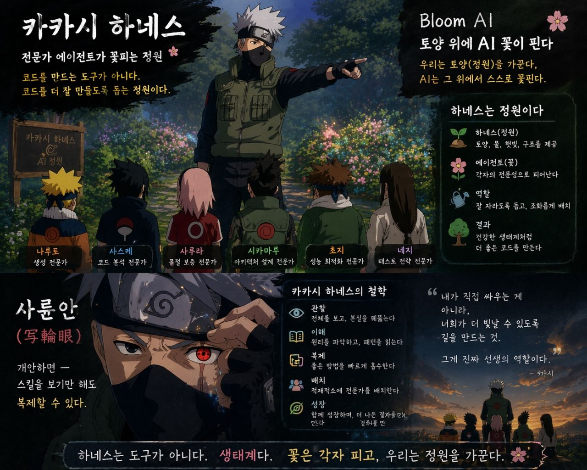

**언어 / Language / 言語**: 🇰🇷 한국어 (현재) · [🇺🇸 English](naruto-harness-story-tutorial.en.md) · [🇯🇵 日本語](naruto-harness-story-tutorial.ja.md)

# 카카시 하네스 세계관 튜토리얼 — 나루토로 이해하기

> 이 문서는 `docs` 하위의 입문용 스토리라인이다.
> 하네스의 실제 운영 규칙은 `harness/knowledge/lore/naruto-worldview.md`를 정전(canon)으로 따른다.

## 1. 이야기는 이렇게 시작한다

당신은 어느 날 코드 숲 앞에 선다.

숲 안에는 오래된 레거시, 실패하는 테스트, 아직 이름 붙이지 못한 설계 냄새, 그리고 가끔은 성능 병목이 숨어 있다. 혼자 들어가도 되지만, 하네스 세계관에서는 당신이 무작정 칼을 들고 뛰어드는 사람이 아니다.

당신은 **나루토**다.

나루토는 이 세계의 주인공이다. 하지만 주인공이라는 말이 모든 일을 혼자 한다는 뜻은 아니다. 나루토는 문제를 가져오고, 전투의 방향을 정하고, 필요할 때 강력한 술법을 발동한다. 하네스에서 이것은 **사용자**, 또는 **호출자(caller)** 의 위치다.

## 2. 카카시는 왜 직접 싸우지 않는가

숲 입구에서 카카시가 기다리고 있다.

카카시는 강하지만, 하네스에서 그의 강함은 "내가 다 해치운다"가 아니다. 그는 정원지기다. 어떤 문제에 어떤 전문가를 붙일지, 어느 시점에 평가를 돌릴지, 지금은 공격해야 하는지 관찰해야 하는지 안다.

그래서 카카시는 직접 모든 코드를 고치기보다, 하네스 안의 에이전트를 적재적소에 배치한다.

| 이야기 속 인물 | 하네스에서의 의미 | 쉽게 말하면 |
|---|---|---|
| 나루토 | 사용자 / 호출자 | 문제를 들고 오는 사람 |
| 카카시 | tamer / 정원지기 | 누구에게 맡길지 정하는 사람 |
| 현자 | sage agent | 거장의 사고법을 빌려주는 존재 |
| 차크라 카카시 | shadow observer | 작업 뒤 토큰 사용을 돌아보는 관찰자 |

여기서 중요한 점은 하나다.

**카카시는 주인공을 빼앗지 않는다.**

사용자가 나루토라면, 카카시는 사용자가 더 좋은 결정을 내리도록 팀을 구성해 주는 선생이다. 하네스가 "정원"이라는 비유를 쓰는 이유도 여기에 있다. 카카시는 꽃을 대신 피우는 사람이 아니라, 어떤 꽃이 어디서 잘 자랄지 아는 사람이다.

## 3. 사륜안은 기술을 복사한다

카카시의 대표 능력은 사륜안이다.

하네스에서 사륜안은 스킬을 보고 그 구조를 읽어내는 능력에 가깝다. 어떤 스킬이 어떤 입력을 받고, 어떤 절차로 움직이며, 어떤 출력물을 남기는지 파악한다. 그리고 필요한 경우 그 패턴을 하네스 안으로 가져온다.

이것은 매우 강력하지만 한계가 있다.

사륜안은 **기술**을 복사한다. 즉, 이미 눈앞에 있는 술법의 형태를 읽는다. 하지만 어떤 문제는 기술만으로 부족하다. 왜 이 평가를 해야 하는지, 어떤 기준으로 학습해야 하는지, 실패를 통과/실패로만 볼 것인지 아니면 다음 실험의 재료로 볼 것인지가 더 중요해지는 순간이 있다.

그때 나루토는 다른 술법을 쓴다.

## 4. 두꺼비 소환술은 사상을 부른다

두꺼비 소환술은 단순히 강한 동료를 하나 더 부르는 기술이 아니다.

하네스 세계관에서 두꺼비 소환술은 **현자 소환**이다. 과거의 거장, 이미 검증된 사상 체계를 현재 작업장으로 불러온다. 데밍을 부르면 품질과 개선을 PDSA로 바라보게 되고, 훗날 파울러를 부르면 리팩터링과 아키텍처를 진화적 설계 관점으로 보게 될 수 있다.

사륜안과 소환술의 차이는 이렇게 정리할 수 있다.

| 능력 | 가져오는 것 | 하네스식 의미 |
|---|---|---|
| 사륜안 | 기술, 절차, 패턴 | 스킬을 읽고 복사한다 |
| 두꺼비 소환술 | 사상, 기준, 세계관 | 현자의 사고 체계를 작업에 적용한다 |

그래서 "데밍 현자를 소환한다"는 말은 단순히 QA 체크리스트를 하나 더 돌린다는 뜻이 아니다.

그것은 작업 전체를 이렇게 다시 묻는다는 뜻이다.

- Plan: 우리는 무엇을 예상했는가?
- Do: 실제로 무엇을 했는가?
- Study: 결과에서 무엇을 배웠는가?
- Act: 다음 주기에는 무엇을 바꿀 것인가?

하네스에서 데밍이 첫 현자인 이유도 여기에 있다. 평가 자체가 그의 영역이기 때문이다.

## 5. 분신술은 병렬 작업이다

분신술은 여러 에이전트가 동시에 움직이는 장면으로 이해하면 쉽다.

예를 들어 하나의 작업 안에서 보안, 성능, 테스트 관점을 나눠 봐야 한다면 각 전문가가 병렬로 움직일 수 있다. 이때 분신술은 "아무렇게나 많이 부르기"가 아니다. 너무 많이 부르면 차크라가 고갈된다.

하네스식으로 말하면, 병렬 에이전트는 강력하지만 토큰 비용이 있다. 그래서 카카시는 필요한 만큼만 배치해야 한다.

## 6. 차크라는 토큰이다

나루토 세계에서 차크라가 모든 술법의 자원이라면, 하네스에서 차크라는 토큰이다.

입력 토큰, 출력 토큰, 캐시 토큰이 모두 차크라다. 좋은 닌자는 무작정 큰 술법을 난사하지 않는다. 좋은 하네스도 마찬가지다. 필요한 문맥을 읽고, 필요한 전문가를 부르고, 결과를 남길 만큼만 에너지를 쓴다.

여기서 **차크라 카카시**가 등장한다.

차크라 카카시는 작업 중간에 끼어들어 흐름을 방해하지 않는다. 대신 일이 끝난 뒤 조용히 나타나 묻는다.

> 이번 전투에서 차크라는 어디에 쓰였는가?
> 다음에는 더 짧고 정확하게 움직일 수 있는가?

이 역할은 코드 품질만큼이나 작업 방식의 품질을 다룬다.

## 7. 첫 번째 에피소드: 데밍 현자 소환

이제 하나의 장면으로 묶어 보자.

나루토인 당신이 말한다.

> "이번 작업이 제대로 된 개선인지 보고 싶어. 데밍 현자를 소환해."

카카시는 고개를 끄덕인다. 그는 먼저 계약을 확인한다. 하네스에 `sage-deming`이 등록되어 있는지 본다. 등록되어 있다면 두꺼비 소환술이 발동된다.

연기 속에서 데밍 현자가 나타난다. 그는 코드를 바로 칭찬하거나 꾸짖지 않는다. 대신 작업을 PDSA 사이클로 다시 펼쳐 놓는다.

| 단계 | 데밍 현자가 묻는 질문 |
|---|---|
| Plan | 처음에 세운 가설은 무엇이었나? |
| Do | 실제로 무엇을 실행했나? |
| Study | 예상과 결과의 차이에서 무엇을 배웠나? |
| Act | 다음 반복에서 무엇을 조정할 것인가? |

이 순간 하네스는 단순한 리뷰 도구가 아니라 학습 장치가 된다.

테스트가 통과했는지 확인하는 데서 끝나지 않고, 왜 그런 결과가 나왔는지 공부한다. 이것이 PDSA에서 `Check`가 아니라 `Study`가 중요한 이유다.

## 8. 이 튜토리얼의 사용법

이 문서를 읽을 때는 세계관을 외우려고 하지 않아도 된다.

대신 다음 네 문장만 기억하면 된다.

1. 나는 나루토다. 문제를 들고 오고, 필요하면 소환한다.
2. 카카시는 정원지기다. 직접 다 싸우지 않고, 적절한 전문가를 배치한다.
3. 현자는 거장의 사상이다. 단순한 팁이 아니라 사고 체계를 빌려준다.
4. 차크라는 토큰이다. 강한 술법일수록 비용을 의식해야 한다.

이 네 문장이 잡히면 하네스의 나루토 매핑은 장식이 아니라 기억 장치가 된다.

카카시 하네스는 "에이전트를 많이 붙이는 시스템"이 아니다. 사용자가 주인공으로 남은 채, 정원지기와 현자와 관찰자를 불러 더 나은 학습 루프를 만드는 방식이다.

## 9. 정전 문서와의 관계

이 튜토리얼은 설명을 위한 이야기다. 새 인물이나 새 술법을 추가하는 근거가 되지 않는다.

운영 규칙을 바꾸려면 반드시 정전 문서인 `harness/knowledge/lore/naruto-worldview.md`에 먼저 반영해야 한다. 이 문서는 그 규칙을 처음 읽는 사람이 더 쉽게 이해하도록 돕는 안내판이다.
