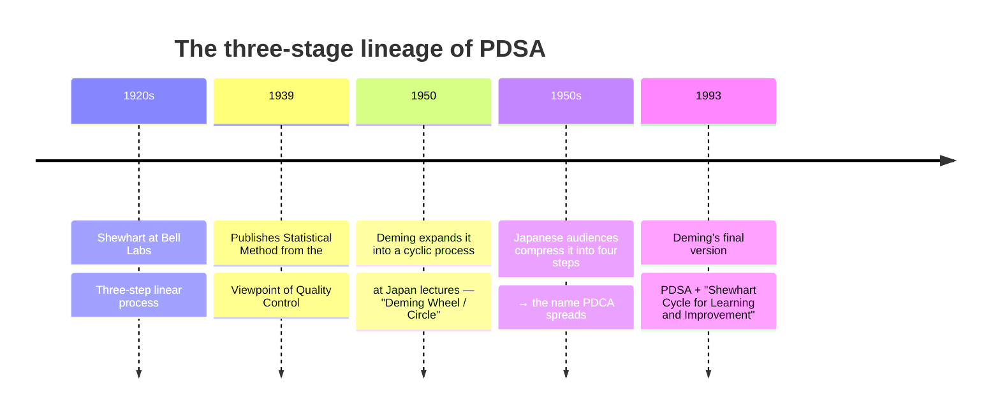
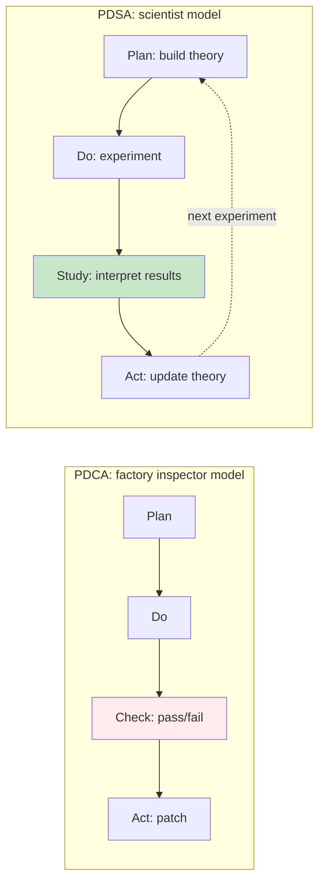

# 🔁 PDSA vs PDCA — Why Deming Called "Check" a Corruption

> **One-sentence summary**: PDCA is not Deming's cycle. Deming himself rejected it as *"the corruption PDCA,"* and stuck with **PDSA (Plan-Do-Study-Act)** for his entire life. The difference between "Check" and "Study" is not a single word — it is an **entire philosophy of improvement**.
>
> v1.0 · 2026-04-21 · Audience: Quality managers, QA, SRE, agile coaches, improvement-culture designers.

---

## 1. Primary evidence — Deming refused the name "PDCA"

This article begins from a single quoted line. Letters preserved by the W. Edwards Deming Institute contain Deming's own blunt wording:

> *"…be sure to call it PDSA, not the corruption PDCA."*
> — Dr. W. Edwards Deming, from correspondence (cited by The W. Edwards Deming Institute)

Another record is even sharper:

> *"What you propose is not the Deming Cycle. I don't know the source of the cycle that you propose. How the PDCA ever came into existence I know not."*
> — W. Edwards Deming

Many textbooks, blogs, and internal docs call PDCA "the Deming Cycle," but **Deming himself never once accepted that name as his own.** That is the starting line of this article.

---

## 2. The real origin of the cycle — Walter Shewhart (1920s)

Deming's "Deming Cycle" was not even invented by Deming. The prototype came from **Walter A. Shewhart**, a physicist at Bell Telephone Laboratories in the 1920s. Shewhart is remembered as the father of Statistical Quality Control (SQC).

Shewhart presented a **three-step linear process** in his 1939 book. In 1950, during his Japan lectures, Deming expanded the concept into a wheel-shaped cycle, and local audiences condensed it for factory use into the **four-step PDCA**. That condensed form spread worldwide, planting the misconception that "Deming = PDCA."

In his 1993 book *The New Economics for Industry, Government, Education*, Deming finalized the name as **"Shewhart Cycle for Learning and Improvement,"** with its content locked in as **Plan–Do–Study–Act**.

---

## 3. Why it must be "Study" and not "Check"

It looks like a single word changed — but the semantic terrain is completely different.

| Dimension | Check (pass/fail) | Study (observe / learn) |
|-----------|-------------------|--------------------------|
| **Attitude** | Inspector's gaze — hold back, inspect | Researcher's gaze — observe, analyze |
| **Question** | "Did it pass or fail?" | "Why did this result happen? What did we learn?" |
| **Result handling** | Binary verdict → move to next step | Theory validation and revision → design next cycle |
| **Knowledge asset** | Pass-rate statistics | Accumulated causes, conditions, and context |
| **Improvement direction** | Patch only the failed part | Update the whole underlying theory |

Distilled from Deming's own explanations as preserved by IHI and the Deming Institute:

- **"Check"** carries the nuance of *"hold back to inspect"* — halting a finished artifact and stamping it pass or fail.
- **"Study"** is closer to Shewhart's original intent — *predict → act → observe → revise theory*, the scientific method in motion.

In short, **PDCA speaks the language of QC (Quality Control) on a shop floor**, while **PDSA speaks the language of QI (Quality Improvement) in a research lab**. That is why Deming went as far as calling PDCA a *"corruption."*

---

## 4. Where PDSA actually runs today

PDCA appears more often in manufacturing textbooks, but in **fields that explicitly pursue "learning organizations,"** PDSA is the standard.

| Field | Standard adopter | Core use |
|-------|------------------|----------|
| **Healthcare quality improvement** | IHI (Institute for Healthcare Improvement) — Model for Improvement | Small-scale tests (1 patient, 1 day) → learn → scale |
| **UK NHS / AQuA** | Model for Improvement (IHI-adopted) | Clinical process improvement, change test logs |
| **SRE / DevOps** | Postmortem culture (Google SRE Book) | "Blameless Postmortem" = Study the system, not the person |
| **Agile** | Sprint Retrospective (Phase 5) | "What went well / What didn't / What to try" = Study |
| **QA harness** | QAWORKFLOW QC-FLOW Phase 5 | "No Phase 5 = not PDSA, it's PD-skip" |

In particular, **IHI's Model for Improvement** is the largest-scale real adoption of PDSA as a formal cycle. As of 2026, hospitals and public health institutions worldwide still distribute PDSA-named improvement worksheets. While the software quality field was busy with PDCA, the medical field cemented PDSA as the default during the same period.

---

## 5. A practical question template for the "Study" phase

*"Okay, Study matters — but concretely, what are we supposed to ask?"*

To actually run Study rather than Check on the ground, you need a **question set**. Drawing on the IHI PDSA Worksheet and Google SRE Postmortem, here are four suggested questions:

> **The four Study-phase questions**
>
> 1. **Prediction vs. reality** — How far did our pre-experiment prediction diverge from what actually happened? What caused the gap?
> 2. **Influence of conditions** — Which conditions (environment, data, users) was the result particularly sensitive to?
> 3. **Holes in our theory** — If this result is correct, which of our previously held assumptions must be revised?
> 4. **Reproducibility** — Have we documented the conditions under which another team, at another time, could reproduce this result?

Compared to a Check-style checklist (*"goal met? Y/N"*), Study **doubts the theory, decomposes the conditions, and scrutinizes reproducibility.** It is much more tiring — but without it, **the next Plan cannot be designed on top of the previous result.** Skip it, and every cycle just repeats the same Plan.

---

## 6. So where do we start changing things?

> "In your improvement meeting, instead of asking 'Did it pass?', ask **'What surprised us?'**"

Try swapping the question once, and the texture of the meeting changes noticeably.

### Three steps to graft PDSA onto a team

1. **Start by renaming the documents.**
   "QA Check list" → "QA Study list." "Check Phase" → "Study Phase." The reason Deming insisted on the name is that language prescribes behavior.
2. **Add a "Prediction vs. reality" column to your retro / postmortem template.**
   A template that records only pass/fail is Check. A template that captures *"what we predicted vs. what actually happened"* is Study.
3. **Treat surprising results as the most valuable asset.**
   A test that passed only confirms what you already knew. The raw material for Study lives at the **points where prediction broke**. A culture that logs those first is the core of PDSA.

---

## 7. Closing — the stubbornness of one word

Picture Deming writing *"corruption PDCA"* in letters for over forty years, and you start to understand why an aging scholar was so relentless about a single word.

Changing "Check" to "Study" is **moving the organization from an entity that inspects artifacts to an entity that converts experience into theory.** The first kind of organization repeats the same failures; the second kind gets a little smarter with every cycle.

> **Practice**: In your next sprint retro, replace *"Did we check it?"* with **"What did we Study?"** You will be able to observe the team shifting from the language of *pass/fail* to the language of *hypothesis/observation/revision*.
>
> And once that shift sticks, your team has finally started turning **the "cycle of learning"** that Shewhart drew in the 1920s and Deming preserved for his entire life.

---

## References

**Primary sources / institutions**

- [PDSA Cycle — The W. Edwards Deming Institute](https://deming.org/explore/pdsa/)
- [Foundation and History of the PDSA Cycle (Ronald Moen, PDF)](https://deming.org/wp-content/uploads/2020/06/PDSA_History_Ron_Moen.pdf)
- [Circling Back (Deming Institute Publications, PDF)](https://deming.org/wp-content/uploads/2020/06/circling-back.pdf)
- [Deming FAQ — Deming Institute](https://deming.org/about-us/f-a-qs/)

**Deming's own books (primary)**

- Deming, W. E. (1986). *Out of the Crisis*. MIT Press. [MIT Press page](https://mitpress.mit.edu/9780262541152/out-of-the-crisis/)
- Deming, W. E. (1993). *The New Economics for Industry, Government, Education*. [Google Books](https://books.google.com/books/about/The_New_Economics.html?id=RnsCXffehcEC)

**Modern applications of PDSA (IHI, healthcare QI)**

- [Plan-Do-Study-Act (PDSA) Worksheet — IHI](https://www.ihi.org/library/tools/plan-do-study-act-pdsa-worksheet)
- [Model for Improvement — IHI](https://www.ihi.org/library/model-for-improvement)
- [How to Improve: Testing Changes — IHI](https://www.ihi.org/how-improve-model-improvement-testing-changes)
- [PDSA cycles and the Model for Improvement — NHS AQuA (PDF)](https://aqua.nhs.uk/wp-content/uploads/2023/07/qsir-pdsa-cycles-model-for-improvement.pdf)

**Comparison and historical commentary**

- [The History of PDSA, PDCA, and Dr. Deming — JFlinch](https://www.jflinch.com/the-history-of-pdsa-pdca-and-dr-deming/)
- [PDCA Cycle or PDSA Cycle: Which is Right? — Six Sigma](https://6sigma.com/pdca-cycle-or-pdsa-cycle-which-is-right/)
- [History of the Kaizen PDCA Cycle — Creative Safety Supply](https://www.creativesafetysupply.com/articles/history-of-the-kaizen-pdca-cycle/)
- [PDCA — Wikipedia](https://en.wikipedia.org/wiki/PDCA)
- [W. Edwards Deming — Wikipedia](https://en.wikipedia.org/wiki/W._Edwards_Deming)
